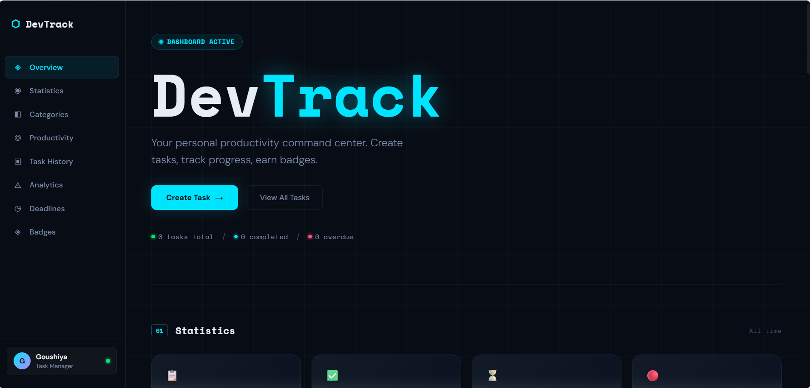
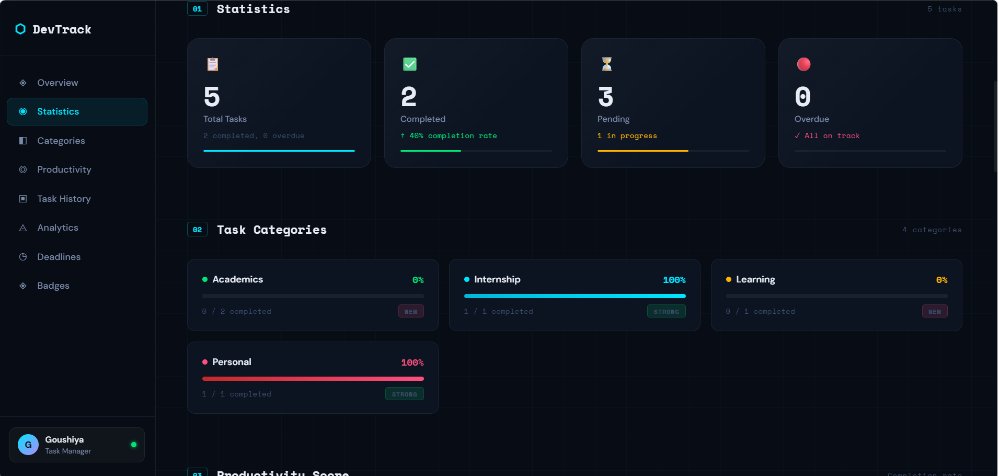
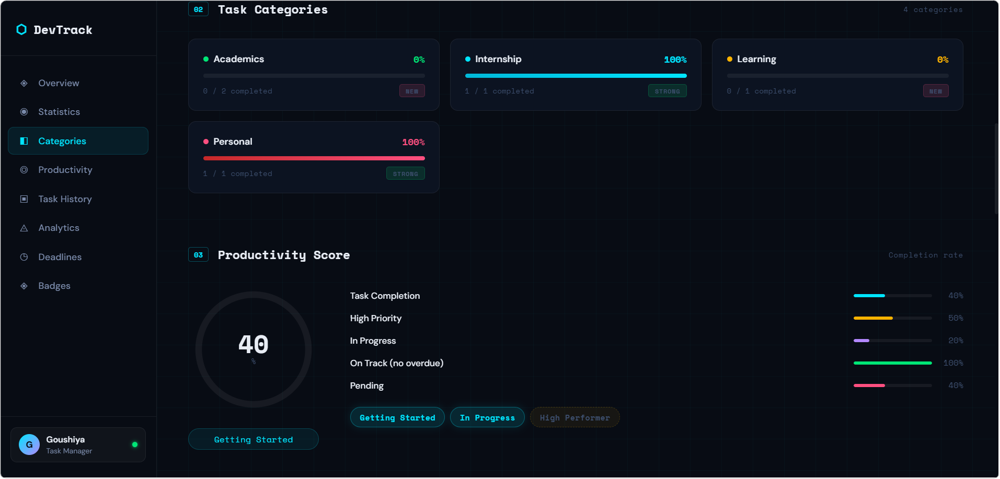
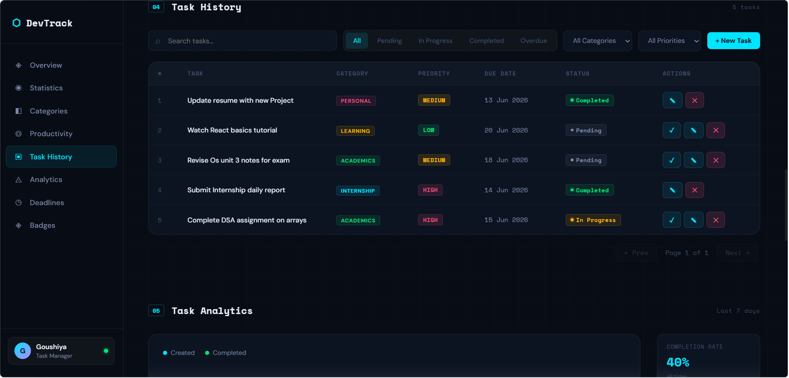
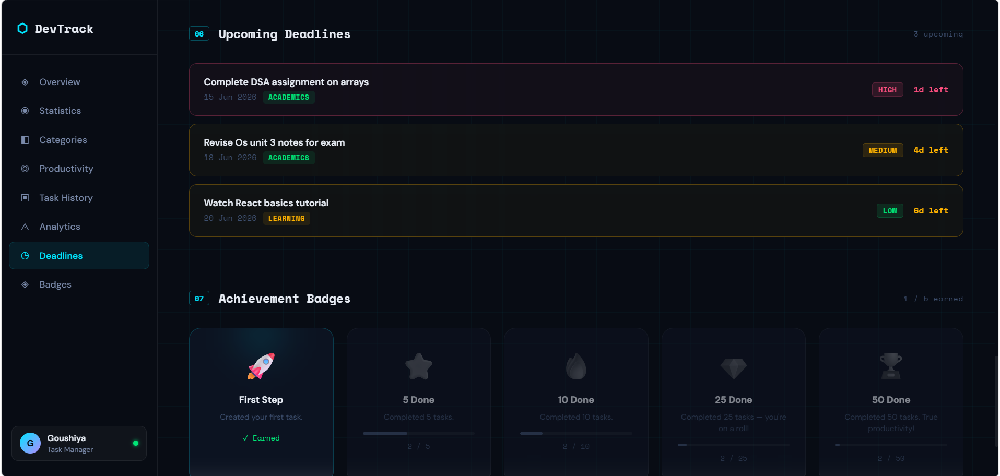
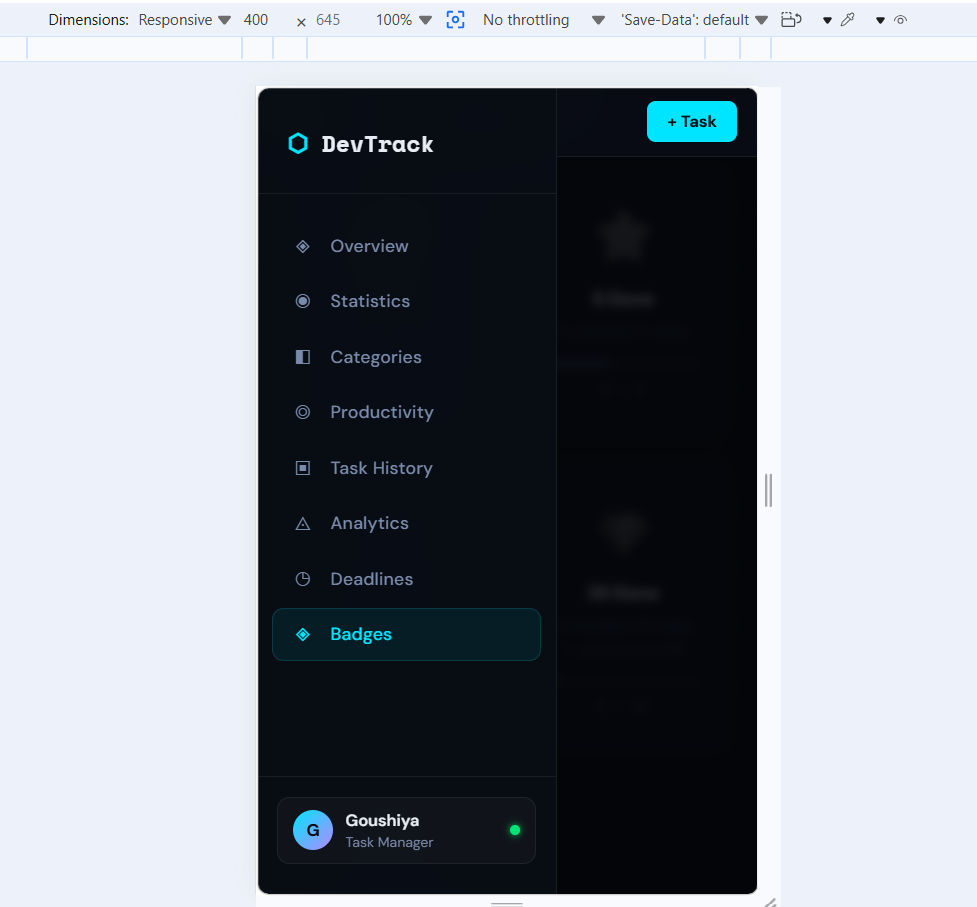
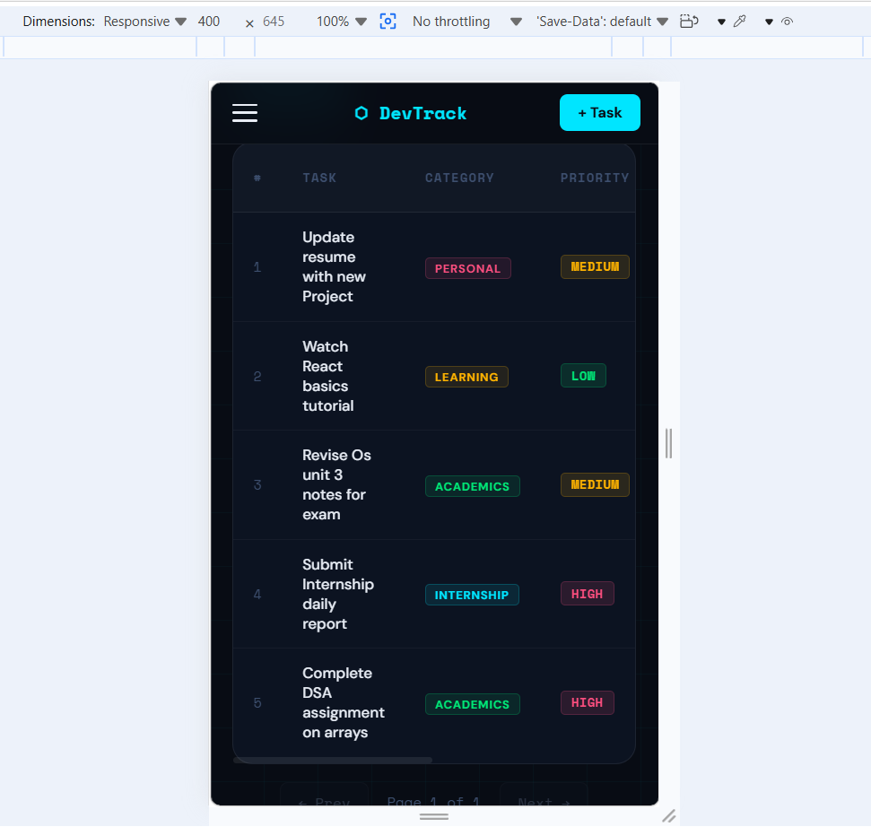

# DevTrack — Personal Task Management Dashboard
## 🌐 Live Demo

https://goushiya28.github.io/Task-1-ShaikGoushiyaSulthana/

**DecodeLabs Full Stack Development Internship — Project 1: Responsive Frontend Interface**

DevTrack is a fully responsive, vanilla HTML/CSS/JavaScript task management dashboard built as Project 1 for the DecodeLabs Industrial Training Kit. It goes beyond a static layout — it's a complete client-side application with persistent data, dynamic statistics, and an achievement system.

## 🚀 Live Features

- **Task CRUD** — create, edit, and delete tasks with title, description, category, priority, due date, and status, persisted via `localStorage`.
- **Statistics Dashboard** — live counts for total, completed, pending, and overdue tasks with animated progress bars.
- **Category Breakdown** — per-category completion tracking with progress bars and color coding.
- **Productivity Score** — animated circular progress indicator calculated from task completion rate, with performance level badges (Getting Started / In Progress / High Performer).
- **Task History Table** — searchable, filterable (status, category, priority) and paginated.
- **Analytics** — a custom-built bar chart comparing tasks created vs. completed, plus key stat highlights.
- **Upcoming Deadlines** — auto-sorted by urgency with live countdown timers.
- **Achievement Badges** — unlockable milestones with progress tracking and toast notifications.
- **Fully Responsive** — mobile-first layout with breakpoints at 768px (tablet) and 1024px (desktop); collapsible sidebar navigation with hamburger menu on mobile.

## 🛠 Tech Stack

- **HTML5** — semantic landmarks (`<header>`, `<nav>`, `<main>`, `<article>`, `<footer>`)
- **CSS3** — CSS Grid (macro layout) + Flexbox (components), `clamp()` for fluid typography, mobile-first media queries
- **JavaScript (Vanilla)** — DOM manipulation, `localStorage` persistence, `IntersectionObserver` for scroll-spy and scroll-reveal animations
- **No frameworks** — built entirely with core web fundamentals, as specified in the project brief

## 📁 Project Structure

```
├── index.html
├── style.css
├── main.js
├── README.md
└── Screenshots/
    ├── Overview.png
    ├── Statistics.png
    ├── Categories.png
    ├── Taskhistory.png
    ├── Deadlines.png
    ├── Badges-Desktop view.png
    ├── Mobileview.png
    └── Mobileview2.png

```

## 📸 Project Screenshots

### Dashboard Overview


### Statistics Dashboard


### Categories Section


### Task History


### Upcoming Deadlines


### Achievement Badges


### Mobile Responsive View


### Mobile Task Table View


## ▶️ Running Locally

1. Clone or download this repository.
2. Open `index.html` in a browser (or use VS Code's Live Server extension for the best experience).
3. No build steps, dependencies, or installation required.

## 📱 Responsive Design

| Breakpoint        | Behavior |
|-------------------|----------|
| **Mobile** (<768px)  | Sidebar collapses behind hamburger menu, stats/badges show 2 columns, sections stack vertically |
| **Tablet** (≥768px)  | Sidebar visible, grids expand via `auto-fit`, form fields go side-by-side |
| **Desktop** (≥1024px) | Productivity & analytics sections split into multi-column layouts |

## 🔮 Future Enhancements

This frontend is designed to be API-ready — future iterations will integrate an Express.js + PostgreSQL backend to replace `localStorage` with persistent server-side storage, as part of the ongoing DecodeLabs internship track.

---
**Author:** Shaik Goushiya Sulthana
**Internship:** DecodeLabs — Full Stack Development (Industrial Training Kit, 2026 Batch)
